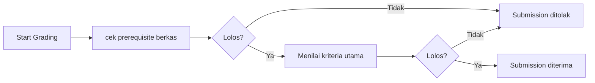

```mermaid
flowchart LR
    A[Start Grading] --> Z[cek prerequisite berkas]
    Z --> AA{Lolos?}
    AA -- Tidak --> X[Submission ditolak]
    AA -- Ya --> B[Menilai kriteria utama]
    B --> C{Lolos?}
    C -- Ya --> Y[Submission diterima]
    C -- Tidak --> X
```
